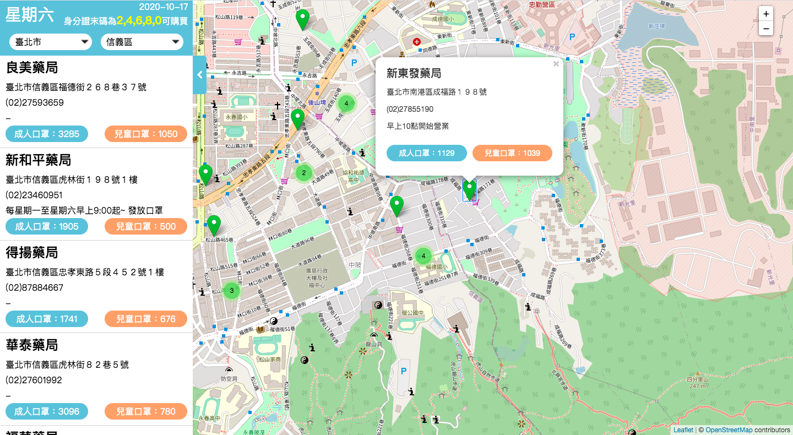

# Mask Map 口罩即時查詢
===========================
2019年12月底爆發新型冠狀病毒，疫情日趨擴大，導致全台口罩陷入不足的情況，後來政府實施口罩實名制，才得以控制每個人購買口罩的數量，因此政府產出了“口罩地圖”且提供API供大家使用。

[UI設計稿](https://challenge.thef2e.com/user/2259?schedule=4452#works-4452) - 作者：Wendy  
[口罩地圖](https://boomga-liu.github.io/Mask_Map/) - 作者：Boomga-liu 

## 專案說明
* 使用 Leaflet 地圖繪製工具
* 使用 OpenStreetMap 地圖資料
* 使用 AJAX 串接政府開放資料
* 使用 JavaScript 撰寫使用者互動功能
* CSS 切版並支援 RWD 響應式網站
